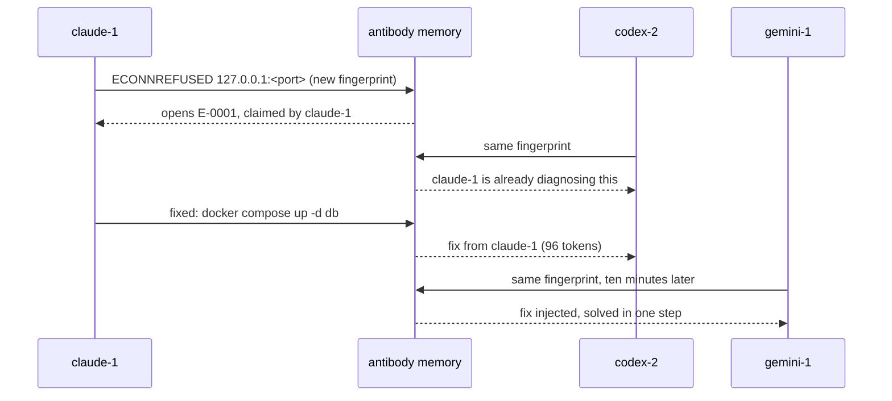

# antibody

**Herd immunity for coding-agent fleets.** When one agent beats an error, every agent running beside it becomes immune.


> **Status: M3, a mixed fleet.** antibody installs as a Claude Code plugin, and
> `antibody setup` adds it to Gemini CLI and Codex CLI. Hooks capture errors, claims
> keep two agents from diagnosing the same new one, and a recorded fix reaches the
> other sessions in the repository at their next tool call, whichever CLI they run.
> Five MCP tools let any agent look errors up and record fixes. The `antibody watch`
> view comes next; the [roadmap](docs/roadmap.md) has the rest.


## The problem

Running many coding agents in parallel is now normal. Tools like herdr, vibe-kanban,
superset, claude-squad and paperclip will happily start eight Claude Code, Codex and
Gemini CLI sessions on one repo, each in its own git worktree.

Then all eight hit the same wall. A fresh worktree has no `.env`. The generated
Prisma client is missing. Playwright has no browsers. Port 3000 belongs to another
agent's dev server. Someone changed `package.json` and the lockfile is stale. Each
agent diagnoses the same failure on its own, from scratch, and each diagnosis costs
800 to 3,000 tokens of thinking and trial.

The bigger the fleet, the more you pay for the same answer. Nothing in the current
tools passes a fix from one running agent to the next.

## What antibody does

antibody is a small layer that sits underneath whatever runs your agents. It does
not start agents, manage worktrees or plan tasks. It watches for errors and moves
fixes between agents.

1. **Capture.** A hook fires when a tool call fails. antibody normalizes the message
   (ports, paths, timestamps and ids become placeholders) and turns it into a
   12-character fingerprint, so every agent's copy of an error matches.
2. **Claim.** The first agent to hit a new fingerprint claims it. An agent that hits
   the same error while the first is still working on it is told a peer is already
   on it, instead of starting a second diagnosis.
3. **Store.** When the claimant gets past the error, its fix goes into shared memory:
   a redacted, human-editable `ANTIBODIES.md` plus an event log.
4. **Inject.** Every agent that hits that fingerprint afterwards gets the fix pushed
   into its context through the harness's own hook, capped at 120 tokens, before it
   starts guessing.



Shared memory lives in the repository's common git directory
(`git rev-parse --git-common-dir`), which every worktree of the repo already shares.
It needs no server, no database and no configuration, and it is never committed
unless you export it.

## Install in Claude Code

antibody needs Node.js 22.13 or newer on your `PATH`. In Claude Code:

```text
/plugin marketplace add Shyboy0499/antibody
/plugin install antibody@antibody
```

Then restart Claude Code. The plugin is the repository itself: its hooks run the
committed `dist/antibody.mjs`, so there is nothing to build. From then on every
session in every git repository takes part. Sessions in different worktrees of one
repository share a memory, and sessions in different repositories do not.

What happens next is automatic:

- A tool call fails. The hook fingerprints the error. If it is new, this session
  claims it and records it in `ANTIBODIES.md`, and the agent sees nothing.
- Another session hits the same error. If the first is still on it, the second is
  told who is diagnosing it, and waits for the fix instead of starting over. If a fix
  is known, it is pushed into the agent's context, within 120 tokens.
- The agent gets past the error. antibody notices the next comparable call succeed
  and asks once for the fix, which the agent records with `antibody_record`. The
  sessions that were waiting get it at their next tool call.

The MCP server gives every session five tools: `antibody_lookup`, `antibody_record`,
`antibody_list`, `antibody_forget` and `antibody_stats`. The memory is plain files
you can read and edit:

```sh
cat "$(git rev-parse --git-common-dir)/antibody/ANTIBODIES.md"
```

A hook never blocks or breaks a session. Outside a repository, on any error, or past
three seconds it prints nothing. Set `ANTIBODY_DEBUG=1` to see why on stderr.

### Measured

[`scripts/e2e.mjs`](scripts/e2e.mjs) runs the M2 check against the committed bundle,
the way Claude Code calls it, and CI runs it on every push. Two sessions in two
worktrees hit the same missing-`.env` error. The fix the first session records reaches
the second on its next tool call: **48 ms** later on a GitHub Actions runner, and
about 65 ms later in the development container. It then plays the same exchange
between Claude Code, Gemini CLI and Codex CLI agents in all six directions, and each
fix arrives about 50 ms after it is recorded.

Each hook call is a separate Node.js process, so most of its cost is starting one. A
hook loads nothing beyond Node's own start-up: it starts no git process, hashes in
plain JavaScript instead of loading `node:crypto`, and keeps the streams stack out. The
median hook call takes:

| Call | GitHub Actions runner | Development container |
| --- | ---: | ---: |
| A tool call fails | 47 to 49 ms | 59 to 61 ms |
| A tool call succeeds | 37 ms | 44 to 46 ms |
| Outside a git repository | 32 ms | 37 to 38 ms |
| `node -e 0`, for scale | 23 ms | 26 to 29 ms |

The roadmap's target is under 50 ms per call. On the runner every kind of call meets
it; in the development container a failing call is still about 10 ms over.

## Install in Gemini CLI and Codex CLI

Neither CLI can share this repository as a plugin, so `antibody setup` writes
antibody into their own settings. Clone the repository anywhere, then run setup for
each CLI you use:

```sh
git clone https://github.com/Shyboy0499/antibody ~/.local/share/antibody
node ~/.local/share/antibody/dist/antibody.mjs setup gemini   # ~/.gemini/settings.json
node ~/.local/share/antibody/dist/antibody.mjs setup codex    # ~/.codex/hooks.json
```

- **Gemini CLI** gets hooks on `SessionStart`, `BeforeAgent`, `AfterTool` and
  `SessionEnd`, plus the MCP server. Restart Gemini CLI to load them.
- **Codex CLI** gets hooks on `SessionStart`, `UserPromptSubmit`, `PostToolUse` and
  `SessionEnd`. Codex runs new hooks once you trust them in `/hooks`, and setup prints
  the `codex mcp add` command for the MCP server. Codex gives a hook a shell command's
  output but not its exit code, so antibody counts a command as failed only when its
  output ends in an error line, and never for commands that only display text (`cat`,
  `grep`, `git log` and the like).

Run setup again after moving the clone. `--remove` takes antibody out again,
`--print` shows the result without writing it, and a settings file with comments is
never rewritten.

### Other agents

Any agent that speaks MCP can use the tools. It pulls fixes instead of having them
pushed. Point it at the server, named after the agent:

```json
{
  "mcpServers": {
    "antibody": {
      "command": "node",
      "args": ["/path/to/antibody/dist/antibody.mjs", "mcp", "cursor"]
    }
  }
}
```

and add one line to the project's `AGENTS.md`:

```markdown
When a command fails with an error you have not seen, call antibody_lookup before
diagnosing it; when you get past it, record the fix with antibody_record.
```

The server finds the repository from the directory it starts in, so configure it per
project.

## See it

`antibody watch` (milestone M4) will be the live fleet view, in your terminal next
to the agents: each agent's state, the antibodies in memory, the tokens saved, and the
event stream as it happens.

[`demo/index.html`](demo/index.html) is a simulated run of that screen with eight
agents. Open it in a browser and press `m` to turn shared memory off: the fleet goes
back to paying for the same diagnosis over and over.

## Works with

| Agent | How antibody connects | Fix delivery |
| --- | --- | --- |
| Claude Code (works today) | Plugin: `PostToolUseFailure`, `PostToolUse`, `SessionStart`, `UserPromptSubmit` and `SessionEnd` hooks, plus an MCP server | Pushed through `additionalContext` |
| Gemini CLI (works today) | `antibody setup gemini`: `SessionStart`, `BeforeAgent`, `AfterTool` and `SessionEnd` hooks plus the MCP server in `~/.gemini/settings.json` | Pushed through `hookSpecificOutput.additionalContext` |
| Codex CLI (works today) | `antibody setup codex`: `SessionStart`, `UserPromptSubmit`, `PostToolUse` and `SessionEnd` hooks in `~/.codex/hooks.json`, plus `codex mcp add` | Pushed through `hookSpecificOutput.additionalContext`; shell failures inferred from their output |
| Cursor, OpenCode, Aider and others | MCP server only | Pulled when the agent calls `antibody_lookup` |

The Gemini CLI and Codex CLI adapters were written against the payloads in each
CLI's own source (Gemini CLI 0.62.0, Codex CLI 0.160.1), and the end-to-end check
plays those payloads in every direction.

It works under any orchestrator, because it only needs the agents' own hooks:
herdr, vibe-kanban, superset, claude-squad, agent-orchestrator, paperclip, or plain
`git worktree add` and a few terminals.

## What works today

| Piece | Where | State |
| --- | --- | --- |
| Fingerprints: normalize an error, hash it to 12 characters | `src/signature.ts` | Built |
| Mandatory redaction of keys, tokens, e-mails and paths | `src/redact.ts` | Built |
| The `ANTIBODIES.md` entries document, safe under concurrent writers | `src/store.ts` | Built; also reads dsh-errkb's `ERRORS.md` |
| Matching: exact, fuzzy and by code | `src/match.ts` | Built |
| Capture: classifying failures, the noise rule | `src/capture.ts` | Built |
| Notices, their caps, fix trust and the injector | `src/notice.ts`, `src/trust.ts`, `src/injector.ts` | Built |
| Resolution detection | `src/resolve-detect.ts` | Built |
| Hit counters and trust records in `state.json` | `src/state.ts` | Built |
| The memory directory in the git common directory | `src/paths.ts` | Built |
| The `events.jsonl` event log | `src/events.ts` | Built |
| Claims, so only one agent diagnoses a new error | `src/claims.ts` | Built |
| The fleet loop: claims, claim hints, held fixes, trust and per-session caps per hook call | `src/fleet.ts`, `src/session.ts` | Built |
| The Claude Code adapter and the `antibody` command line | `src/claude-code.ts`, `src/cli.ts`, `dist/antibody.mjs` | Built |
| The five agent tools and the MCP server | `src/tools.ts`, `src/mcp.ts` | Built |
| The Claude Code plugin | `.claude-plugin/`, `hooks/hooks.json` | Built; validated with `claude plugin validate` |
| The Gemini CLI and Codex CLI adapters | `src/gemini.ts`, `src/codex.ts`, `src/hook-input.ts` | Built; payloads read off each CLI's source |
| `antibody setup` for Gemini CLI and Codex CLI | `src/setup.ts` | Built |
| `antibody watch` | `demo/index.html` | M4; simulated demo only |

## Built on dsh-errkb

antibody's core came from [dsh-errkb](https://github.com/jingchangzhao-gif/dsh-errkb),
an error knowledge base for a single DeepSeek Harness agent. Its pure layer
(fingerprinting, redaction, the markdown store, matching, capture, notices, fix trust,
state and resolution detection) came over with its tests and keeps its MIT notice in
[`NOTICE`](NOTICE). antibody replaced the single-harness wiring with what a fleet needs:
the shared memory directory, the event log and claims.

## Development

Node 22.13 or newer and pnpm 11.

```sh
pnpm install
pnpm test            # vitest with the 99% statements and lines gate
pnpm run typecheck
pnpm run lint
pnpm run format:check
pnpm run build       # lib/ and the dist/antibody.mjs bundle, via tsdown
pnpm run e2e         # the M2 exchange end to end, plus hook latency
```

`dist/antibody.mjs` is committed, because Claude Code runs the plugin straight from
git. CI fails when a source change is pushed without the rebuilt bundle.

CI runs all of these on every push and pull request, plus a privacy guard that rejects
personal paths, private e-mail addresses and credential-shaped tokens. See
[`CONTRIBUTING.md`](CONTRIBUTING.md) before opening a pull request.

## Documents

- [Design](docs/design.md): how capture, claims, storage, injection and the fleet view work, plus failure modes and open questions
- [Landscape](docs/landscape.md): the October 2026 survey of about 40 multi-agent and agent-memory projects, and the gaps it found
- [Roadmap](docs/roadmap.md): milestones from the core port to a published benchmark

## License

[MIT](LICENSE). Code ported from dsh-errkb keeps its own MIT notice; see [`NOTICE`](NOTICE).
