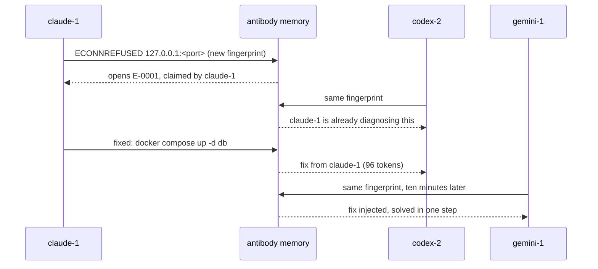

# antibody

**Herd immunity for coding-agent fleets.** When one agent beats an error, every agent running beside it becomes immune.


> **Status: M1 done.** The core and the shared memory are built and tested:
> fingerprinting, redaction, the `ANTIBODIES.md` store, matching, notices, fix trust,
> claims and the event log, proven against eight concurrent writer processes. Nothing
> connects to an agent yet; that is milestone M2, the Claude Code plugin. So there
> is still nothing to install. The [roadmap](docs/roadmap.md) has the rest.


## The problem

Running many coding agents in parallel is now normal. Tools like herdr, vibe-kanban,
superset, claude-squad and paperclip will happily start eight Claude Code, Codex and
Gemini CLI sessions on one repo, each in its own git worktree.

Then all eight hit the same wall. A fresh worktree has no `.env`. The generated
Prisma client is missing. Playwright has no browsers. Port 3000 belongs to another
agent's dev server. Someone changed `package.json` and the lockfile is stale. Each
agent diagnoses the same failure on its own, from scratch, and each diagnosis costs
800 to 3,000 tokens of thinking and trial.

The bigger the fleet, the more you pay for the same answer. Nothing in the current
tools passes a fix from one running agent to the next.

## What antibody does

antibody is a small layer that sits underneath whatever runs your agents. It does
not start agents, manage worktrees or plan tasks. It watches for errors and moves
fixes between agents.

1. **Capture.** A hook fires when a tool call fails. antibody normalizes the message
   (ports, paths, timestamps and ids become placeholders) and turns it into a
   12-character fingerprint, so every agent's copy of an error matches.
2. **Claim.** The first agent to hit a new fingerprint claims it. An agent that hits
   the same error while the first is still working on it is told a peer is already
   on it, instead of starting a second diagnosis.
3. **Store.** When the claimant gets past the error, its fix goes into shared memory:
   a redacted, human-editable `ANTIBODIES.md` plus an event log.
4. **Inject.** Every agent that hits that fingerprint afterwards gets the fix pushed
   into its context through the harness's own hook, capped at 120 tokens, before it
   starts guessing.



Shared memory lives in the repository's common git directory
(`git rev-parse --git-common-dir`), which every worktree of the repo already shares.
It needs no server, no database and no configuration, and it is never committed
unless you export it.

## See it

`antibody watch` is the live fleet view, and it runs in your terminal, next to the
agents. It shows each agent's state, the antibodies in memory, the tokens saved, and
the event stream as it happens.

[`demo/index.html`](demo/index.html) is a simulated run of that screen with eight
agents. Open it in a browser and press `m` to turn shared memory off: the fleet goes
back to paying for the same diagnosis over and over.

## Works with

| Agent | How antibody connects | Fix delivery |
| --- | --- | --- |
| Claude Code | Plugin: `PostToolUseFailure` and `PostToolUse` hooks, plus an MCP server | Pushed through `additionalContext` |
| Codex CLI | `PostToolUse` hook (`~/.codex/hooks.json`), plus MCP | Pushed through the hook |
| Gemini CLI | Extension: `AfterTool` hook, plus MCP | Pushed through `hookSpecificOutput.additionalContext` |
| Cursor, OpenCode, Aider and others | MCP server only | Pulled when the agent calls `antibody_lookup` |

Hook payloads for Codex CLI and Gemini CLI are taken from their public docs and get
verified in milestone M3.

It works under any orchestrator, because it only needs the agents' own hooks:
herdr, vibe-kanban, superset, claude-squad, agent-orchestrator, paperclip, or plain
`git worktree add` and a few terminals.

## What works today

| Piece | Where | State |
| --- | --- | --- |
| Fingerprints: normalize an error, hash it to 12 characters | `src/signature.ts` | Built |
| Mandatory redaction of keys, tokens, e-mails and paths | `src/redact.ts` | Built |
| The `ANTIBODIES.md` entries document, safe under concurrent writers | `src/store.ts` | Built; also reads dsh-errkb's `ERRORS.md` |
| Matching: exact, fuzzy and by code | `src/match.ts` | Built |
| Capture: classifying failures, the noise rule | `src/capture.ts` | Built |
| Notices, their caps, fix trust and the injector | `src/notice.ts`, `src/trust.ts`, `src/injector.ts` | Built |
| Resolution detection | `src/resolve-detect.ts` | Built |
| Hit counters and trust records in `state.json` | `src/state.ts` | Built |
| The memory directory in the git common directory | `src/paths.ts` | Built |
| The `events.jsonl` event log | `src/events.ts` | Built |
| Claims, so only one agent diagnoses a new error | `src/claims.ts` | Built |
| Claude Code plugin and MCP server | | M2 |
| Codex CLI and Gemini CLI adapters | | M3 |
| `antibody watch` | `demo/index.html` | M4; simulated demo only |

## Built on dsh-errkb

antibody's core came from [dsh-errkb](https://github.com/jingchangzhao-gif/dsh-errkb),
an error knowledge base for a single DeepSeek Harness agent. Its pure layer
(fingerprinting, redaction, the markdown store, matching, capture, notices, fix trust,
state and resolution detection) came over with its tests and keeps its MIT notice in
[`NOTICE`](NOTICE). antibody replaced the single-harness wiring with what a fleet needs:
the shared memory directory, the event log and claims.

## Development

Node 22.13 or newer and pnpm 11.

```sh
pnpm install
pnpm test            # vitest with the 99% statements and lines gate
pnpm run typecheck
pnpm run lint
pnpm run format:check
pnpm run build       # lib/ via tsdown
```

CI runs all of these on every push and pull request, plus a privacy guard that rejects
personal paths, private e-mail addresses and credential-shaped tokens.

## Documents

- [Design](docs/design.md): how capture, claims, storage, injection and the fleet view work, plus failure modes and open questions
- [Landscape](docs/landscape.md): the October 2026 survey of about 40 multi-agent and agent-memory projects, and the gaps it found
- [Roadmap](docs/roadmap.md): milestones from the core port to a published benchmark

## License

[MIT](LICENSE). Code ported from dsh-errkb keeps its own MIT notice; see [`NOTICE`](NOTICE).
